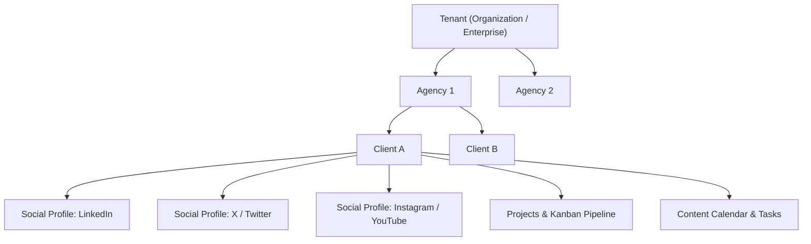

# Architecture Guidelines & System Instructions

This document specifies the core architecture, security design, and engineering guidelines for **Insight One**. All team members and AI assistants must follow these rules without exception.

---

## 1. System Overview & Hierarchy

Insight One is an enterprise multi-tenant system structured around an agency portfolio model:



### Key Architectural Tenets:
1. **Multi-Tenancy Isolation**: A tenant isolates an entire organization. Data never leaks across `tenant_id` boundaries.
2. **Agency Sub-Division**: A single tenant may operate multiple business units or agencies (`agencies`), each handling its dedicated client base.
3. **Client Social Profiles**: Clients own multiple social media profiles for automated engagement, analytics, and content publishing.
4. **Referential Integrity**: All audit logging, creation, and mutation tracking strictly references `public.profiles(id)` as the foreign key.

---

## 2. Mandatory Multi-Tenancy Column Standard

Every business entity table in the database **must** incorporate the following standard columns:

| Column Name | Data Type | Nullable | Default | Description |
| :--- | :--- | :--- | :--- | :--- |
| `id` | `INTEGER GENERATED BY DEFAULT AS IDENTITY` | **No** | Identity | Primary key identifier across tables. |
| `code` | `TEXT` | **No** | None | Human-readable unique code (e.g., `PRJ-001`, `CLI-042`). |
| `data` | `JSONB` | Yes | `NULL` | Structured domain-specific payload. |
| `metadata` | `JSONB` | Yes | `NULL` | Extensible operational and diagnostic metadata. |
| `access_control` | `JSONB` | Yes | `NULL` | Granular record-level ACL permissions. |
| `tenant_id` | `INTEGER` | **No** | None | Foreign key referencing `public.tenants(id)`. |
| `is_active` | `BOOLEAN` | **No** | `true` | Soft-delete flag; records are rarely permanently deleted. |
| `created_by` | `INTEGER` | **No** | None | Foreign key referencing `public.profiles(id)`. |
| `created_at` | `TIMESTAMPTZ` | **No** | `now()` | Record creation timestamp. |
| `updated_by` | `INTEGER` | Yes | `NULL` | Foreign key referencing `public.profiles(id)`. |
| `updated_at` | `TIMESTAMPTZ` | **No** | `now()` | Last update timestamp. |

---

## 3. Profiles & Authentication Model

User authentication is anchored to Supabase `auth.users`, while detailed domain profiles reside in `public.profiles`:

```sql
CREATE TABLE public.profiles (
    id INTEGER GENERATED BY DEFAULT AS IDENTITY NOT NULL,
    user_id UUID NOT NULL,
    email TEXT NOT NULL,
    full_name TEXT NULL,
    phone TEXT NULL,
    avatar_url TEXT NULL,
    is_active BOOLEAN NOT NULL DEFAULT true,
    created_at TIMESTAMPTZ NOT NULL DEFAULT now(),
    updated_at TIMESTAMPTZ NULL,
    data JSONB NULL,
    metadata JSONB NULL,
    access_control JSONB NULL,
    user_name TEXT NULL,
    tenant_id INTEGER NOT NULL,
    created_by INTEGER NOT NULL,
    updated_by INTEGER NULL,

    CONSTRAINT profiles_pkey1 PRIMARY KEY (id),
    CONSTRAINT profiles_email_unique UNIQUE (email),
    CONSTRAINT profiles_id_tenant_unique UNIQUE (id, tenant_id),
    CONSTRAINT profiles_user_id_unique UNIQUE (user_id),
    CONSTRAINT profiles_tenant_id_fkey FOREIGN KEY (tenant_id) REFERENCES public.tenants (id),
    CONSTRAINT profiles_created_by_fkey FOREIGN KEY (created_by) REFERENCES public.profiles (id) DEFERRABLE INITIALLY DEFERRED,
    CONSTRAINT profiles_updated_by_fkey FOREIGN KEY (updated_by) REFERENCES public.profiles (id) DEFERRABLE INITIALLY DEFERRED,
    CONSTRAINT profiles_user_id_fkey FOREIGN KEY (user_id) REFERENCES auth.users (id) ON DELETE CASCADE
) TABLESPACE pg_default;
```

---

## 4. Role-Based Access Control (RBAC)

The platform specifies **5 exact roles**:

1. **`Role Host`**: Super-administrator at the platform/host tier with full access across all tenants and administrative tools.
2. **`Tenant Admin`**: Organizational administrator managing agency setups, team memberships, billing, and tenant configurations.
3. **`content creator`**: Operations specialist responsible for drafting content, producing media assets, and executing project tasks.
4. **`content approver`**: Lead strategist/editor responsible for reviewing copy, approving client deliverables, and publishing schedules.
5. **`Viewer`**: Read-only stakeholder, client guest, or executive observer with view access only.

### Dynamic Navigation Menu
- Sidebar menus are never hard-coded in the UI.
- The `public.role_menu_items` table maps routes and icons directly to roles and scopes.
- When an authenticated user opens the application, `fn_navigation_menu()` loads the exact items authorized for their active role.

---

## 5. Security & RPC Execution Protocol

### Inviolable Rule: Zero Inline Queries in TypeScript
> [!CAUTION]
> **No inline database query statements (`supabase.from('...').insert(...)`, `.select(...)`, `.update(...)`) are permitted in application `.ts` / `.tsx` files.**
> All database access, mutations, and queries MUST go through PostgreSQL stored functions (`supabase.rpc('fn_name', params)`).

### Function Design Rules:
1. **`SECURITY DEFINER`**: All functions execute as `SECURITY DEFINER` with `SET search_path = public, pg_temp` to prevent schema search path hijacking.
2. **Context & Scope Verification**: Every RPC function begins by calling `fn_get_request_context(p_function_name)`. If the user is unauthenticated or lacks the required scope, execution immediately terminates with a 403 / 401 response.
3. **Parameter Naming**: Every input parameter **must start with `p_`** (e.g., `p_code`, `p_name`, `p_tenant_id`, `p_page_size`).
4. **Output Format**: Every RPC function must return a `JSONB` object.

---

## 6. Standard JSONB Response Envelope

All RPC functions return a unified envelope structure:

```json
{
  "is_success": true,
  "data": { ... },
  "paging": {
    "total_records": 100,
    "page_size": 25,
    "page_index": 1
  },
  "message": "Operation completed successfully",
  "status_code": 200
}
```

### Common Helper Functions:
1. **`fn_response_success(p_data, p_paging, p_message, p_status_code)`**:
   Formats and returns successful JSONB payloads.
2. **`fn_response_error(p_function_name, p_error_code, p_safe_message, p_status_code, p_error_detail, p_error_hint, p_context)`**:
   - Sanitizes raw internal SQL error strings to prevent leaking database details to clients.
   - Inserts the technical error with caller context into the `public.error_log` table.
   - Returns a friendly, safe message to the client application.

---

## 7. Frontend User Experience Standards

1. **Routing & Landing Flow**:
   - The root route `/` is reserved for the public marketing landing page.
   - Workspace operations are accessed through `/login` and hosted inside `/dashboard` and module routes.

2. **Sidebar Profile Placement & Context Menu**:
   - The user profile badge is situated at the **bottom-left** of the sidebar navigation.
   - Clicking the user profile opens an interactive context popup with:
     - Profile details modal link (`View Profile`).
     - Workspace configuration link (`Workspace Settings`).
     - Safe sign-out action (`Sign Out`).
   - Standard sidebar links must **never duplicate Settings and Logout** in the main navigation list.

3. **Sticky Page Header with Top-Right Actions**:
   - The page header bar is fixed/frozen (`sticky top-0 z-30`).
   - Page-level primary action buttons (e.g., "+ Add Client", "+ New Task", "Export Data") are strictly positioned in the **top-right corner** of the header bar.

4. **Kanban Board Presentations**:
   - Pipelines (Projects and Content) present items as Kanban boards with drag-and-drop or column-based progress updates.

5. **Modal & Dialog Box Specifications**:
   - **Large Dimensions**: Dialogs default to large sizes (`3xl` to `5xl`) so complex forms can be viewed without cramped scrolling.
   - **Three-Tier Anatomy**:
     1. **Fixed Header**: Title, subtitle, and close button remain visible at the top.
     2. **Scrollable Content**: Only the central form/body area scrolls when overflow occurs.
     3. **Fixed Footer**: Action buttons (Cancel, Save, Submit) are pinned to the bottom.

6. **Universal Searchable Dropdown**:
   - All dropdowns across the application must use the standard `SearchableSelect` component.
   - Native HTML `<select>` elements are prohibited.

7. **Unified Authentication Experience**:
   - The login page features a single email/password entry form.
   - No tab switching between "Employee" and "Admin"; the system resolves the user's role and privileges dynamically from their database profile upon sign-in.
 