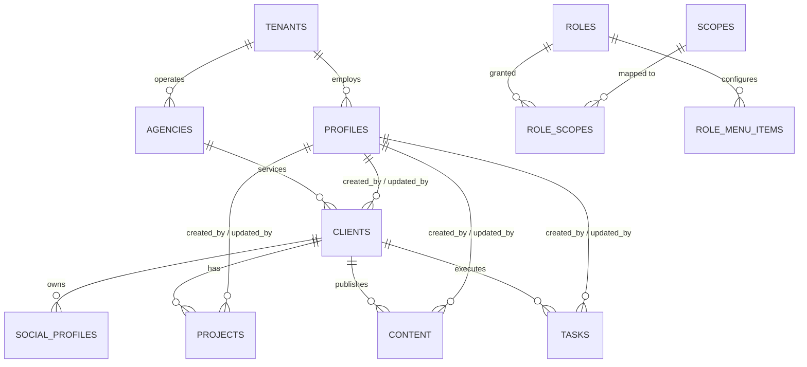

# Database Specification & Schema Architecture

This document provides the definitive data dictionary, entity-relationship models, and constraints for the **Insight One** PostgreSQL database running on Supabase.

---

## 1. Entity-Relationship Architecture



---

## 2. The Multi-Tenant Standard Columns

Every business table in Insight One must implement this exact set of 11 multi-tenancy columns:

```sql
id            INTEGER GENERATED BY DEFAULT AS IDENTITY NOT NULL,
code          TEXT NOT NULL,
data          JSONB NULL,
metadata      JSONB NULL,
access_control JSONB NULL,
tenant_id     INTEGER NOT NULL REFERENCES public.tenants(id) ON DELETE CASCADE,
is_active     BOOLEAN NOT NULL DEFAULT true,
created_by    INTEGER NOT NULL REFERENCES public.profiles(id),
created_at    TIMESTAMPTZ NOT NULL DEFAULT now(),
updated_by    INTEGER NULL REFERENCES public.profiles(id),
updated_at    TIMESTAMPTZ NOT NULL DEFAULT now(),
```

### Purpose of Columns:
- **`id`**: Fast, predictable, auto-incrementing integer identifier.
- **`code`**: Natural business identifier used in URLs, logs, and user interfaces (e.g., `PRJ-1024`, `TSK-4091`).
- **`data`**: Extensible domain attributes without requiring DDL schema alterations.
- **`metadata`**: Diagnostic and audit attributes (e.g., sync timestamps, ingestion source).
- **`access_control`**: Record-level ACL permissions (e.g., restricted access to specific team members).
- **`tenant_id`**: Inviolable multi-tenant isolation key.
- **`is_active`**: Soft deletion flag.
- **`created_by` / `updated_by`**: Mandatory foreign keys referencing `public.profiles(id)`.

---

## 3. Core Multi-Tenancy & RBAC Tables

### 3.1. `public.tenants`
Stores isolated organizational entities.
```sql
CREATE TABLE public.tenants (
    id INTEGER GENERATED BY DEFAULT AS IDENTITY PRIMARY KEY,
    name TEXT NOT NULL,
    slug TEXT NOT NULL UNIQUE,
    plan TEXT NOT NULL DEFAULT 'Enterprise',
    is_active BOOLEAN NOT NULL DEFAULT true,
    created_at TIMESTAMPTZ NOT NULL DEFAULT now(),
    updated_at TIMESTAMPTZ NOT NULL DEFAULT now(),
    data JSONB NULL,
    metadata JSONB NULL
);
```

### 3.2. `public.agencies`
Sub-organizations or agencies operating under a parent tenant.
```sql
CREATE TABLE public.agencies (
    id INTEGER GENERATED BY DEFAULT AS IDENTITY PRIMARY KEY,
    tenant_id INTEGER NOT NULL REFERENCES public.tenants(id) ON DELETE CASCADE,
    code TEXT NOT NULL,
    name TEXT NOT NULL,
    description TEXT NULL,
    is_active BOOLEAN NOT NULL DEFAULT true,
    created_by INTEGER NOT NULL,
    created_at TIMESTAMPTZ NOT NULL DEFAULT now(),
    updated_by INTEGER NULL,
    updated_at TIMESTAMPTZ NOT NULL DEFAULT now(),
    data JSONB NULL,
    metadata JSONB NULL,
    access_control JSONB NULL,
    CONSTRAINT agencies_tenant_code_unique UNIQUE (tenant_id, code)
);
```

### 3.3. `public.profiles`
Links Supabase authenticated users (`auth.users`) to organization profiles.
```sql
CREATE TABLE public.profiles (
    id INTEGER GENERATED BY DEFAULT AS IDENTITY NOT NULL,
    user_id UUID NOT NULL,
    email TEXT NOT NULL,
    full_name TEXT NULL,
    phone TEXT NULL,
    avatar_url TEXT NULL,
    role TEXT NOT NULL DEFAULT 'Viewer',
    department TEXT NOT NULL DEFAULT 'General',
    status TEXT NOT NULL DEFAULT 'Active',
    password TEXT NULL,
    is_active BOOLEAN NOT NULL DEFAULT true,
    created_at TIMESTAMPTZ NOT NULL DEFAULT now(),
    updated_at TIMESTAMPTZ NULL,
    data JSONB NULL,
    metadata JSONB NULL,
    access_control JSONB NULL,
    user_name TEXT NULL,
    tenant_id INTEGER NOT NULL,
    created_by INTEGER NOT NULL,
    updated_by INTEGER NULL,

    CONSTRAINT profiles_pkey1 PRIMARY KEY (id),
    CONSTRAINT profiles_email_unique UNIQUE (email),
    CONSTRAINT profiles_id_tenant_unique UNIQUE (id, tenant_id),
    CONSTRAINT profiles_user_id_unique UNIQUE (user_id),
    CONSTRAINT profiles_tenant_id_fkey FOREIGN KEY (tenant_id) REFERENCES public.tenants (id),
    CONSTRAINT profiles_created_by_fkey FOREIGN KEY (created_by) REFERENCES public.profiles (id) DEFERRABLE INITIALLY DEFERRED,
    CONSTRAINT profiles_updated_by_fkey FOREIGN KEY (updated_by) REFERENCES public.profiles (id) DEFERRABLE INITIALLY DEFERRED,
    CONSTRAINT profiles_user_id_fkey FOREIGN KEY (user_id) REFERENCES auth.users (id) ON DELETE CASCADE
) TABLESPACE pg_default;
```

### 3.4. `public.roles`
Defines available system roles (`Role Host`, `Tenant Admin`, `content creator`, `content approver`, `Viewer`).
```sql
CREATE TABLE public.roles (
    id INTEGER GENERATED BY DEFAULT AS IDENTITY PRIMARY KEY,
    name TEXT NOT NULL UNIQUE,
    display_name TEXT NOT NULL,
    description TEXT NULL,
    is_active BOOLEAN NOT NULL DEFAULT true,
    created_at TIMESTAMPTZ NOT NULL DEFAULT now()
);
```

### 3.5. `public.scopes`
Granular permission identifiers tied to database functions and features.
```sql
CREATE TABLE public.scopes (
    id INTEGER GENERATED BY DEFAULT AS IDENTITY PRIMARY KEY,
    code TEXT NOT NULL UNIQUE,
    module TEXT NOT NULL,
    description TEXT NULL,
    created_at TIMESTAMPTZ NOT NULL DEFAULT now()
);
```

### 3.6. `public.role_scopes`
Join table mapping roles to authorized scopes.
```sql
CREATE TABLE public.role_scopes (
    role_id INTEGER NOT NULL REFERENCES public.roles(id) ON DELETE CASCADE,
    scope_id INTEGER NOT NULL REFERENCES public.scopes(id) ON DELETE CASCADE,
    created_at TIMESTAMPTZ NOT NULL DEFAULT now(),
    PRIMARY KEY (role_id, scope_id)
);
```

### 3.7. `public.role_menu_items`
Database-driven navigation items visible in the sidebar per role.
```sql
CREATE TABLE public.role_menu_items (
    id INTEGER GENERATED BY DEFAULT AS IDENTITY PRIMARY KEY,
    role_id INTEGER NOT NULL REFERENCES public.roles(id) ON DELETE CASCADE,
    label TEXT NOT NULL,
    href TEXT NOT NULL,
    icon TEXT NOT NULL,
    display_order INTEGER NOT NULL DEFAULT 0,
    is_active BOOLEAN NOT NULL DEFAULT true,
    required_scope TEXT NULL,
    created_at TIMESTAMPTZ NOT NULL DEFAULT now()
);
```

### 3.8. `public.error_log`
Central table capturing internal database errors without exposing details to clients.
```sql
CREATE TABLE public.error_log (
    id BIGINT GENERATED BY DEFAULT AS IDENTITY PRIMARY KEY,
    tenant_id INTEGER NULL,
    function_name TEXT NOT NULL,
    error_code TEXT NULL,
    error_message TEXT NULL,
    error_detail TEXT NULL,
    error_hint TEXT NULL,
    user_id UUID NULL,
    profile_id INTEGER NULL,
    metadata JSONB NULL,
    created_at TIMESTAMPTZ NOT NULL DEFAULT now()
);
```

---

## 4. Business Domain Tables

All business tables implement the 11 multi-tenancy columns alongside their domain fields:

### 4.1. `public.clients`
```sql
CREATE TABLE public.clients (
    id INTEGER GENERATED BY DEFAULT AS IDENTITY PRIMARY KEY,
    agency_id INTEGER NULL REFERENCES public.agencies(id) ON DELETE SET NULL,
    code TEXT NOT NULL,
    name TEXT NOT NULL,
    company TEXT NOT NULL,
    email TEXT NOT NULL,
    phone TEXT NULL,
    website TEXT NULL,
    industry TEXT NULL,
    status TEXT NOT NULL DEFAULT 'Active',
    value TEXT DEFAULT '$25k',
    notes TEXT NULL,
    
    -- Mandatory multi-tenancy columns
    data JSONB NULL,
    metadata JSONB NULL,
    access_control JSONB NULL,
    tenant_id INTEGER NOT NULL REFERENCES public.tenants(id) ON DELETE CASCADE,
    is_active BOOLEAN NOT NULL DEFAULT true,
    created_by INTEGER NOT NULL REFERENCES public.profiles(id),
    created_at TIMESTAMPTZ NOT NULL DEFAULT now(),
    updated_by INTEGER NULL REFERENCES public.profiles(id),
    updated_at TIMESTAMPTZ NOT NULL DEFAULT now()
);
```

### 4.2. `public.social_profiles`
Social media channels attached to clients for data analysis.
```sql
CREATE TABLE public.social_profiles (
    id INTEGER GENERATED BY DEFAULT AS IDENTITY PRIMARY KEY,
    client_id INTEGER NOT NULL REFERENCES public.clients(id) ON DELETE CASCADE,
    code TEXT NOT NULL,
    platform TEXT NOT NULL,
    handle TEXT NOT NULL,
    profile_url TEXT NULL,
    followers_count INTEGER NOT NULL DEFAULT 0,

    -- Mandatory multi-tenancy columns
    data JSONB NULL,
    metadata JSONB NULL,
    access_control JSONB NULL,
    tenant_id INTEGER NOT NULL REFERENCES public.tenants(id) ON DELETE CASCADE,
    is_active BOOLEAN NOT NULL DEFAULT true,
    created_by INTEGER NOT NULL REFERENCES public.profiles(id),
    created_at TIMESTAMPTZ NOT NULL DEFAULT now(),
    updated_by INTEGER NULL REFERENCES public.profiles(id),
    updated_at TIMESTAMPTZ NOT NULL DEFAULT now()
);
```

### 4.3. `public.projects`
```sql
CREATE TABLE public.projects (
    id INTEGER GENERATED BY DEFAULT AS IDENTITY PRIMARY KEY,
    client_id INTEGER NULL REFERENCES public.clients(id) ON DELETE CASCADE,
    code TEXT NOT NULL,
    name TEXT NOT NULL,
    description TEXT NULL,
    project_manager TEXT NULL,
    assigned_team TEXT NULL,
    start_date DATE NULL,
    due_date DATE NULL,
    priority TEXT NOT NULL DEFAULT 'Medium',
    status TEXT NOT NULL DEFAULT 'Planning' CHECK (status IN ('Planning', 'In Progress', 'Review', 'Completed', 'On Hold')),
    progress INTEGER NOT NULL DEFAULT 0,

    -- Mandatory multi-tenancy columns
    data JSONB NULL,
    metadata JSONB NULL,
    access_control JSONB NULL,
    tenant_id INTEGER NOT NULL REFERENCES public.tenants(id) ON DELETE CASCADE,
    is_active BOOLEAN NOT NULL DEFAULT true,
    created_by INTEGER NOT NULL REFERENCES public.profiles(id),
    created_at TIMESTAMPTZ NOT NULL DEFAULT now(),
    updated_by INTEGER NULL REFERENCES public.profiles(id),
    updated_at TIMESTAMPTZ NOT NULL DEFAULT now()
);
```

### 4.4. `public.content`
```sql
CREATE TABLE public.content (
    id INTEGER GENERATED BY DEFAULT AS IDENTITY PRIMARY KEY,
    client_id INTEGER NULL REFERENCES public.clients(id) ON DELETE CASCADE,
    code TEXT NOT NULL,
    title TEXT NOT NULL,
    content_type TEXT NULL,
    platform TEXT NULL,
    description TEXT NULL,
    assigned_employee TEXT NULL,
    priority TEXT NOT NULL DEFAULT 'Medium',
    due_date DATE NULL,
    stage TEXT NOT NULL DEFAULT 'idea' CHECK (stage IN (
        'idea', 'topic_approval', 'writing', 'review', 'design', 'client_approval', 'schedule', 'publish'
    )),

    -- Mandatory multi-tenancy columns
    data JSONB NULL,
    metadata JSONB NULL,
    access_control JSONB NULL,
    tenant_id INTEGER NOT NULL REFERENCES public.tenants(id) ON DELETE CASCADE,
    is_active BOOLEAN NOT NULL DEFAULT true,
    created_by INTEGER NOT NULL REFERENCES public.profiles(id),
    created_at TIMESTAMPTZ NOT NULL DEFAULT now(),
    updated_by INTEGER NULL REFERENCES public.profiles(id),
    updated_at TIMESTAMPTZ NOT NULL DEFAULT now()
);
```

### 4.5. `public.tasks`
```sql
CREATE TABLE public.tasks (
    id INTEGER GENERATED BY DEFAULT AS IDENTITY PRIMARY KEY,
    client_id INTEGER NULL REFERENCES public.clients(id) ON DELETE CASCADE,
    code TEXT NOT NULL,
    title TEXT NOT NULL,
    description TEXT NULL,
    assigned_employee TEXT NULL,
    priority TEXT NOT NULL DEFAULT 'Medium',
    status TEXT NOT NULL DEFAULT 'To Do' CHECK (status IN ('To Do', 'In Progress', 'Review', 'Done')),
    due_date DATE NULL,

    -- Mandatory multi-tenancy columns
    data JSONB NULL,
    metadata JSONB NULL,
    access_control JSONB NULL,
    tenant_id INTEGER NOT NULL REFERENCES public.tenants(id) ON DELETE CASCADE,
    is_active BOOLEAN NOT NULL DEFAULT true,
    created_by INTEGER NOT NULL REFERENCES public.profiles(id),
    created_at TIMESTAMPTZ NOT NULL DEFAULT now(),
    updated_by INTEGER NULL REFERENCES public.profiles(id),
    updated_at TIMESTAMPTZ NOT NULL DEFAULT now()
);
```

### 4.6. Additional Module Tables
- **`public.networking`**: Strategic contact records and outreach tracking.
- **`public.engagement`**: Social engagement statistics (likes, comments, reach, impressions).
- **`public.calendar_events`**: Scheduled events, deadlines, and client meetings.
- **`public.reports`**: Generated weekly/monthly portfolio analytics.
